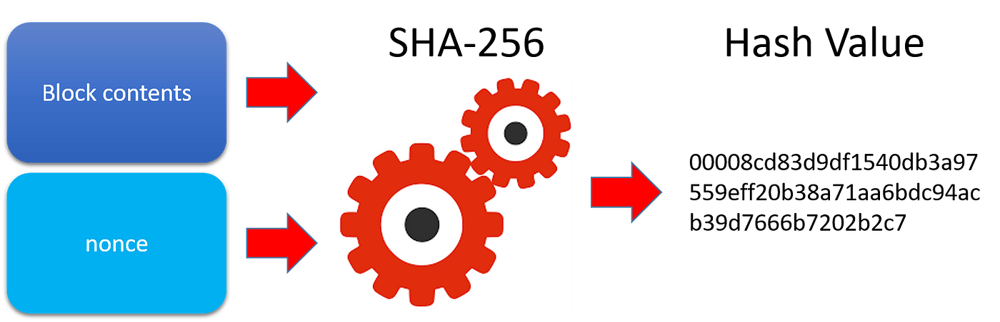
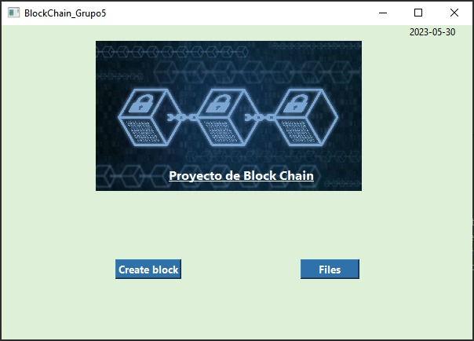
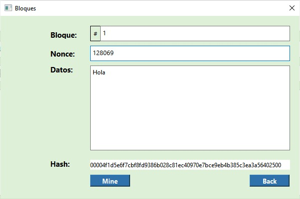
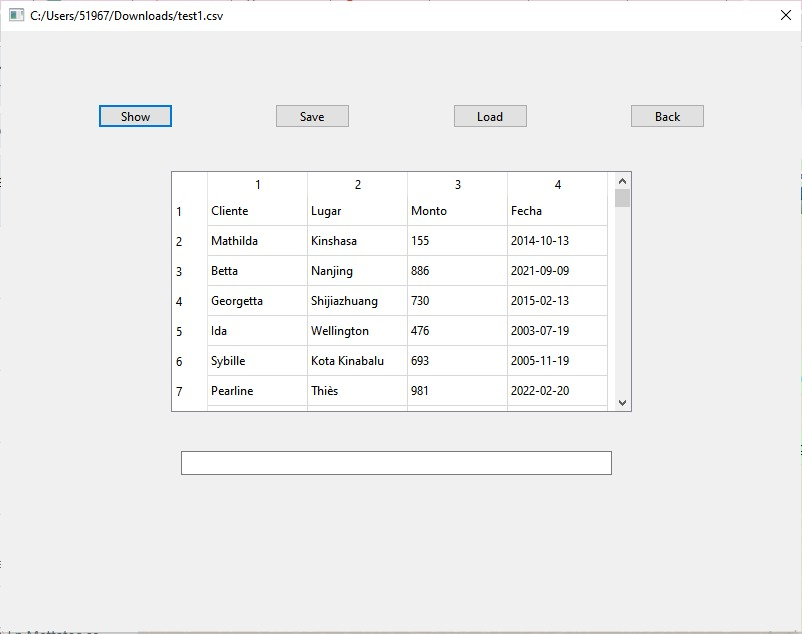

# BlockChain

  
Tabla de contenidos

  
  - [Integrantes](#integrantes)
  - [Introducción](#introducción)
    - [¿Qué es BlockChain?](#qué-es-blockchain)
    - [¿Qué es SHA-256?](#qué-es-sha-256)
      - [¿Cúal es su propósito?](#cual-es-su-proposito)
  - [Objetivo](#objetivo)
  - [Propuesta](#propuesta)
    - [¿Qué estructuras usamos?](#qué-estructuras-usamos)
      1. [AVL](#avl)
      2. [Tabla hash](#tabla-hash)
      3. [Blockchain](#blockchain)
  - [Interfaz grafica](#Interfaz-grafica)
  - [Bibliografía](#bibliografía)

## Integrantes
- Mariana Aurora Capuñay Correa
- Manyory Estefany Cueva Mendoza
- Gustavo Oscar Deza Raygada
- Noé Ananias Paredes Rauraico
- Dario Ricardo Nuñez Villacorta

## Introducción
### ¿Qué es BlockChain?
Un blockchain, o cadena de bloques, es un tipo de estructura de datos que se utiliza para almacenar y verificar registros de transacciones de manera segura y descentralizada. Se compone de una serie de bloques que están enlazados entre sí de manera cronológica y forman una cadena continua.

 
   

Cada bloque contiene información sobre las transacciones realizadas, como la fecha, la hora, las partes involucradas y los detalles específicos de la transacción. Además, cada bloque contiene un identificador único llamado "hash" que se calcula utilizando una función de hash criptográfica. El hash de un bloque también incluye el hash del bloque anterior en la cadena, lo que crea un enlace entre los bloques y garantiza la integridad de la cadena.

   

Una de las características más importantes de un blockchain es su descentralización. En lugar de tener una autoridad central que controle y verifique las transacciones, un blockchain permite que múltiples participantes, llamados nodos, mantengan una copia completa de la cadena y verifiquen las transacciones de forma colectiva. Esto elimina la necesidad de confiar en una sola entidad y mejora la seguridad y la transparencia.

   

Además, la tecnología blockchain utiliza algoritmos criptográficos avanzados para asegurar la privacidad y la autenticidad de las transacciones. Cada transacción se firma digitalmente con claves criptográficas y se registra de forma inmutable en la cadena de bloques, lo que significa que no se puede modificar o eliminar sin dejar rastro. Esto proporciona un alto nivel de seguridad y confianza en la integridad de los datos almacenados en el blockchain.

Un blockchain tiene numerosas aplicaciones en diversos campos. Por ejemplo, es ampliamente utilizado en las criptomonedas, como Bitcoin, como un libro de contabilidad público y transparente para registrar todas las transacciones. También se utiliza en contratos inteligentes, sistemas de votación electrónica, seguimiento de la cadena de suministro y verificación de documentos, entre otros casos de uso.

En resumen, un blockchain es una estructura de datos descentralizada y segura que almacena registros de transacciones en bloques enlazados cronológicamente. Proporciona transparencia, seguridad y confianza en la verificación de las transacciones, y tiene diversas aplicaciones en múltiples industrias.

### ¿Qué es SHA-256?
SHA-256, que significa Algoritmo de Hash Seguro de 256 bits, es una función de hash criptográfica. Es un algoritmo matemático que toma un mensaje de entrada de cualquier longitud y produce una salida de tamaño fijo, que tiene una longitud de 256 bits. Esta salida se conoce comúnmente como hash o código hash.

 
   

#### ¿Cúal es su propósito?
El propósito principal de SHA-256 es asegurar la integridad de los datos y proporcionar una huella digital para un mensaje dado. Esto se logra aplicando una serie de operaciones matemáticas y transformaciones complejas al mensaje de entrada. Estas operaciones incluyen operaciones lógicas a nivel de bits, aritmética modular y funciones lógicas como XOR, AND y OR.

El código hash resultante es único para cada mensaje de entrada único. Incluso un pequeño cambio en el mensaje de entrada producirá un código hash significativamente diferente. Además, el algoritmo SHA-256 está diseñado de tal manera que es computacionalmente inviable invertir el proceso y obtener el mensaje original a partir de su código hash. Esta propiedad se conoce como resistencia a la preimagen, lo que hace que SHA-256 sea una función unidireccional.

SHA-256 se utiliza ampliamente en diversas aplicaciones, como el almacenamiento de contraseñas, firmas digitales, protocolos de comunicación segura, tecnología blockchain y verificación de integridad de datos. Asegura que los datos permanezcan sin cambios durante la transmisión o el almacenamiento al comparar el código hash calculado con el código hash recibido o almacenado.

La longitud de 256 bits del código hash proporciona un gran número de posibles valores de hash, lo que dificulta enormemente que dos mensajes diferentes produzcan el mismo código hash (lo que se conoce como colisión). Esta propiedad mejora la seguridad y confiabilidad de SHA-256 en la protección de información confidencial.

 
  

En resumen, SHA-256 es una función de hash criptográfica que transforma un mensaje de entrada en un código hash de tamaño fijo, proporcionando integridad de datos, identificación única y un alto nivel de seguridad para diversas aplicaciones que requieren un procesamiento de datos seguro y confiable.

### Objetivo
El objetivo del proyecto es implementar un sistema informático transaccional que interactue con datos utilizando una estructura de datos basada en cadenas de bloques (blockchain) para asegurar la integridad y seguridad de los datos. Esta implementacion permitira la carga de datos transaccionales como retiros de dinero, transefencias bancarias o ventas de productos. Tambien, permitira diferentes criterios de busqueda para acceder a la informacion de manera eficiente y rapida.

## Propuesta
### ¿Qué estructuras usamos?
####  AVL:
El arbol AVL es un tipo de arbol binario de busqueda balanceado en el que la diferencia de alturas entre los subarboles izquierdo y derecho de cada uno de los nodos es como maximo 1. En esta estructura la utilizamos para poder guardar los montos y las fechas de las transferencias bancarias, ya que, estos datos son más fáciles que comparar al ser datos de tipo int. Los nodos tienen una estructura key value, es decir, guarda una clave, que sería el numero de id del bloque, y su respectivo valor. Usamos esta estructura para poder sacar el valor maximo y minimo de los bloques, ya que, el codigo es de implementación sencilla y de complejidad O(n log n). Además, implementamos la busqueda por rango ... (falta completar)

  

#### Tabla hash:
Esta estructura se utiliza para implementar eficientemente una lista enlazada  y una tabla hash. La lista enlazada es util para una insercion eficiente al principio de la lista sin la necesidad de  un acceso aleatorio hacia los elementos. Por otro lado, la tabla hash se utiliza para almacenar clave-valor permitiendo un acceso rápido a los valores a traves de las claves unicas que existen. 

  

#### Patricia Trie:
Esta estructura se utiliza para poder guardar el nombre de los emisores y los lugares en donde se realizó la transacción bancaria. Esta estructura es util, ya que, en cada nodo de esta estructura guardamos los prefijos de estos parametros. Utilizamos esta estructura para poder retornar todos los emisores o lugares que empiecen con el mismo prefijo, ya que, es eficiente al tener una complejidad de O(n log n)

  

#### Blockchain:
Simula un blockchain basandose en el circular list con sentinela, la estructura Block y la funcion de hash SHA256. Cada bloque cotiene datos, una huella que se calcula a partir de la huella del bloke anterior y los datos actuales y un nonce que encontramos mediante la funcion SHA256 para cumplir con el requisito de dificultad.

  

## Interfaz grafica
Estamos desarrollando nuestro proyecto utilizando el framework Qt, el cual nos permite crear una interfaz gráfica de usuario (GUI). Con la interfaz gráfica, podemos interactuar con el sistema mediante elementos visuales como ventanas, botones, menús y otros componentes gráficos. Esta interfaz nos proporciona una forma intuitiva y atractiva visualmente para interactuar con el software, en contraste con las interfaces de línea de comandos que requieren la entrada de texto.
En la interfas grafica creamos un "menu" con opciones para crear un bloque o ver los archivos.

  

En el bloque tenemos el numero del bloque, el numero del nonce, los datos y el codigo hash.

  

Los datos que tenemos en este caso son de transacciones, tenemos el cliente, el lugar, el monto y la fecha de transacción.

  

## Bibliografía

- Domínguez Gómez, J. (n.d.). Criptografía: Función SHA-256. https://academy.bit2me.com/wp-content/uploads/2019/10/Criptography_SHA_256_es.pdf

‌- ecanorea. (2021, October 19). Qué es el blockchain y cómo funciona. Plain Concepts. https://www.plainconcepts.com/es/blockchain-guia-principiantes/

‌- Matesanz, V. (2022, January 11). Qué es el blockchain, cómo funciona y cuál es su relación con las criptos [Guía Fácil]. Finect; Finect. https://www.finect.com/usuario/vanesamatesanz/articulos/que-blockchain-criptomonedas-guia-facil#:~:text=El%20blockchain%20es%20un%20ecosistema,forma%20segura%2C%20r%C3%A1pida%20y%20descentralizada.

‌
