# BlockChain

  
Tabla de contenidos

  
  - [Integrantes](#integrantes)
  - [Introducción](#introducción)
    - [¿Qué es BlockChain?](#qué-es-blockchain)
    - [¿Qué es SHA-256?](#qué-es-sha-256)
      - [¿Cúal es su propósito?](#cual-es-su-proposito)
  - [Objetivo](#objetivo)
  - [Propuesta](#propuesta)
    - [¿Qué estructuras usamos?](#qué-estructuras-usamos)
      1. [AVL](#avl)
      2. [Tabla hash](#tabla-hash)
      3. [Boyer Moree](#Boyer-Moree)
      5. [Circular Array](#Circular-Array)
      4. [Blockchain](#blockchain)

  - [Interfaz grafica](#Interfaz-grafica)
  - [Bibliografía](#bibliografía)

## Integrantes
| Apellidos  | Nombres | Actividades realizadas |
| ------------- | ------------- | ------------ |
| Capuñay Correa  | Mariana Aurora | Recalculo en cascada (proof of work), pedir_datos.h, funcionamiento_structs.h | 
| Cueva Mendoza  | Manyory Estefany | Boyer Moore y Tabla Hash |
| Deza Raygada|  Gustavo Oscar| funcionamiento_structs.h y GUI |
| Noé Ananias | Paredes Rauraico| struct Block, Blockchain
| Nuñez Villacorta | Dario Ricardo   | Patricia Trie y AVL |

## Introducción
### ¿Qué es BlockChain?
Un blockchain, o cadena de bloques, es un tipo de estructura de datos que se utiliza para almacenar y verificar registros de transacciones de manera segura y descentralizada. Se compone de una serie de bloques que están enlazados entre sí de manera cronológica y forman una cadena continua.

 
   

Cada bloque contiene información sobre las transacciones realizadas, como la fecha, la hora, las partes involucradas y los detalles específicos de la transacción. Además, cada bloque contiene un identificador único llamado "hash" que se calcula utilizando una función de hash criptográfica. El hash de un bloque también incluye el hash del bloque anterior en la cadena, lo que crea un enlace entre los bloques y garantiza la integridad de la cadena.

  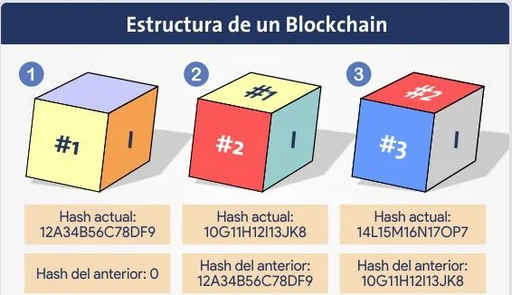 

Una de las características más importantes de un blockchain es su descentralización. En lugar de tener una autoridad central que controle y verifique las transacciones, un blockchain permite que múltiples participantes, llamados nodos, mantengan una copia completa de la cadena y verifiquen las transacciones de forma colectiva. Esto elimina la necesidad de confiar en una sola entidad y mejora la seguridad y la transparencia.

   

Además, la tecnología blockchain utiliza algoritmos criptográficos avanzados para asegurar la privacidad y la autenticidad de las transacciones. Cada transacción se firma digitalmente con claves criptográficas y se registra de forma inmutable en la cadena de bloques, lo que significa que no se puede modificar o eliminar sin dejar rastro. Esto proporciona un alto nivel de seguridad y confianza en la integridad de los datos almacenados en el blockchain.

Un blockchain tiene numerosas aplicaciones en diversos campos. Por ejemplo, es ampliamente utilizado en las criptomonedas, como Bitcoin, como un libro de contabilidad público y transparente para registrar todas las transacciones. También se utiliza en contratos inteligentes, sistemas de votación electrónica, seguimiento de la cadena de suministro y verificación de documentos, entre otros casos de uso.

En resumen, un blockchain es una estructura de datos descentralizada y segura que almacena registros de transacciones en bloques enlazados cronológicamente. Proporciona transparencia, seguridad y confianza en la verificación de las transacciones, y tiene diversas aplicaciones en múltiples industrias.

### ¿Qué es SHA-256?
SHA-256, que significa Algoritmo de Hash Seguro de 256 bits, es una función de hash criptográfica. Es un algoritmo matemático que toma un mensaje de entrada de cualquier longitud y produce una salida de tamaño fijo, que tiene una longitud de 256 bits. Esta salida se conoce comúnmente como hash o código hash.

 
  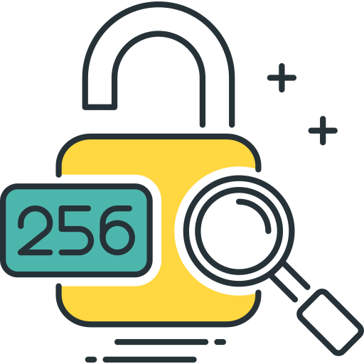 

#### ¿Cúal es su propósito?
El propósito principal de SHA-256 es asegurar la integridad de los datos y proporcionar una huella digital para un mensaje dado. Esto se logra aplicando una serie de operaciones matemáticas y transformaciones complejas al mensaje de entrada. Estas operaciones incluyen operaciones lógicas a nivel de bits, aritmética modular y funciones lógicas como XOR, AND y OR.

El código hash resultante es único para cada mensaje de entrada único. Incluso un pequeño cambio en el mensaje de entrada producirá un código hash significativamente diferente. Además, el algoritmo SHA-256 está diseñado de tal manera que es computacionalmente inviable invertir el proceso y obtener el mensaje original a partir de su código hash. Esta propiedad se conoce como resistencia a la preimagen, lo que hace que SHA-256 sea una función unidireccional.

SHA-256 se utiliza ampliamente en diversas aplicaciones, como el almacenamiento de contraseñas, firmas digitales, protocolos de comunicación segura, tecnología blockchain y verificación de integridad de datos. Asegura que los datos permanezcan sin cambios durante la transmisión o el almacenamiento al comparar el código hash calculado con el código hash recibido o almacenado.

La longitud de 256 bits del código hash proporciona un gran número de posibles valores de hash, lo que dificulta enormemente que dos mensajes diferentes produzcan el mismo código hash (lo que se conoce como colisión). Esta propiedad mejora la seguridad y confiabilidad de SHA-256 en la protección de información confidencial.

 
  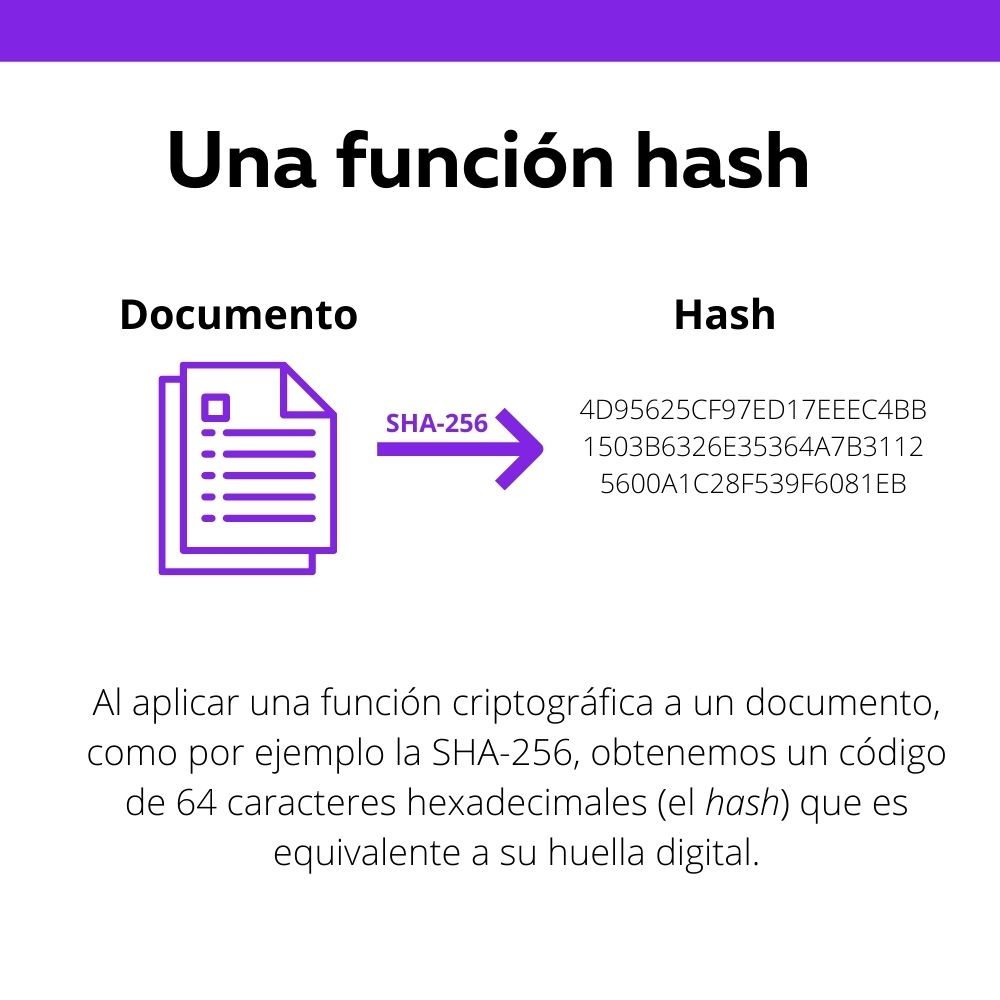

En resumen, SHA-256 es una función de hash criptográfica que transforma un mensaje de entrada en un código hash de tamaño fijo, proporcionando integridad de datos, identificación única y un alto nivel de seguridad para diversas aplicaciones que requieren un procesamiento de datos seguro y confiable.

### Objetivo
El objetivo del proyecto es implementar un sistema informático transaccional que interactue con datos utilizando una estructura de datos basada en cadenas de bloques (blockchain) para asegurar la integridad y seguridad de los datos. Esta implementacion permitira la carga de datos transaccionales como retiros de dinero, transefencias bancarias o ventas de productos. Tambien, permitira diferentes criterios de busqueda para acceder a la informacion de manera eficiente y rapida.

## Propuesta
### ¿Qué estructuras usamos?
####  AVL:
El arbol AVL es un tipo de arbol binario de busqueda balanceado en el que la diferencia de alturas entre los subarboles izquierdo y derecho de cada uno de los nodos es como maximo 1. En esta estructura la utilizamos para poder guardar los montos y las fechas de las transferencias bancarias, ya que, estos datos son más fáciles que comparar al ser datos de tipo int. Los nodos tienen una estructura key value, es decir, guarda una clave, que sería el numero de id del bloque, y su respectivo valor, y para ello utilizamos una estructura llamada Entry. Usamos esta estructura para implementar los criterios de búsqueda de maximo y minimo, ya que, el codigo es de implementación sencilla y de complejidad O(n log n). Además, implementamos el criterio de búsqueda del search_by_range.

  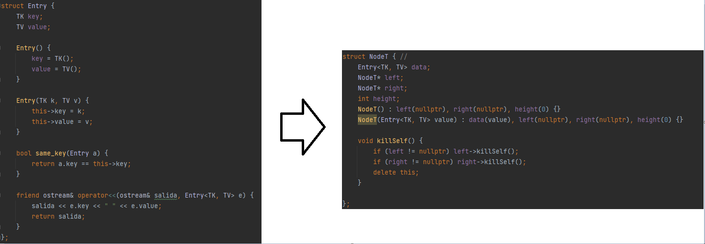

  

#### Tabla hash:
Esta estructura se utiliza para implementar eficientemente una lista enlazada  y una tabla hash. La lista enlazada es útil para una inserción eficiente al principio de la lista sin la necesidad de  un acceso aleatorio hacia los elementos. Por otro lado, la tabla hash se utiliza para almacenar clave-valor permitiendo un acceso rápido a los valores a través de las claves únicas que existen. Utilizamos esta estructura para implementar el criterio de búsqueda search, ya que, tenemos un acceso directo al dato a buscar, ya sea emisor, receptor, monto o lugar de transacción

  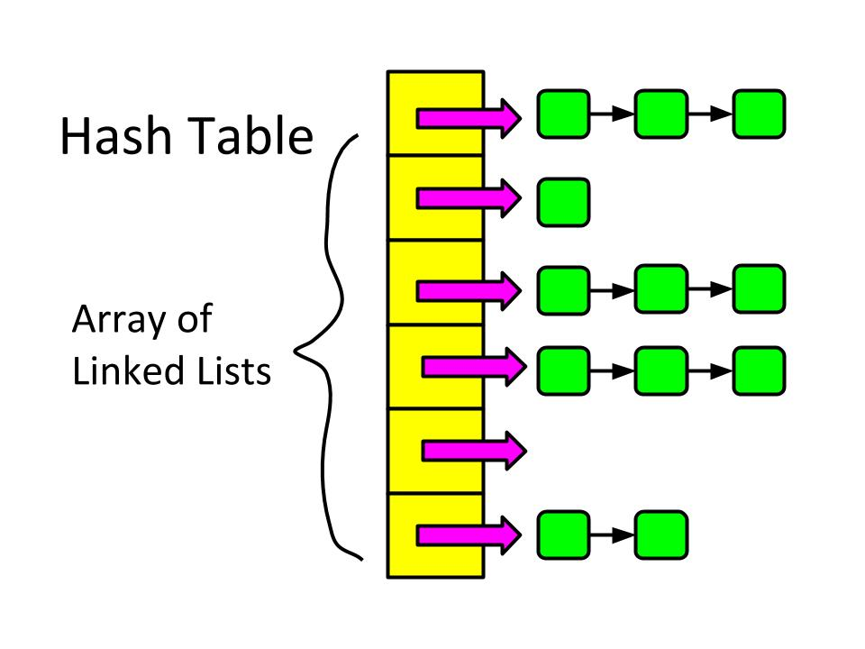

- void insert():  O(1+ n * m + capacidad) 
- bool find(TK key): La complejidad total de esta función puede ser O(1) en el mejor caso (cuando no se encuentran colisiones) y O(n) en el peor caso (cuando hay colisiones y se deben recorrer todos los elementos en la lista).
- void rehashing : O(n * m + capacidad), donde n es el tamaño del ChainHashoriginal ym es el tamaño promedio de las listas.
- void remove: complejidad de O(n), donde n es el tamaño de la lista.

#### Boyer Moree:
El algoritmo es utilizado para buscar un patrón dentro de una cadena de texto de manera eficiente. La función BuscarPatron recibe dos parámetros: la cadena en la que se realizará la búsqueda y el patrón que se desea encontrar. 
Se utiliza una estructura de datos (circular array) para almacenar los índices donde se encuentra el patrón en la cadena.
El algoritmo recorre la cadena de texto de derecha a izquierda, empezando desde la última posición del patrón, si el carácter en la posición actual coincide con el último carácter del patrón, se realiza una comparación en orden inverso para verificar si se encuentra el patrón completo; si se encuentra una coincidencia, se agrega el índice correspondiente al array circular.
Después de encontrar una coincidencia, se realiza un salto en la posición de la cadena de texto para evitar buscar el mismo patrón nuevamente. Se verifica si existen puntos en los extremos del patrón y se incrementa el contador de puntos en caso de encontrarlos, evitando contar el mismo punto dos veces.

Tambien se proporcionan dos funciones adicionales en el código:
1. eliminarContenidoDespuesDelPunto: elimina el contenido después del punto en una cadena a partir de un punto de inicio dado
2. AgregarDespuesDelPunto: agrega contenido después de un punto específico en una cadena.
 
La complejidad es O(longitud de la cadena + longitud del patrón), esto se debe a que el algoritmo realiza saltos en la posición de la cadena lo cual reduce la cantidad de comparaciones necesarias en cada iteración.

#### Circular Array:
El algoritmo representa un arreglo circular. El arreglo se implementa como un array dinámico que puede contener cualquier tipo de dato dentro. 
Proporciona funcionalidades como agregar elementos al frente y al final del arreglo, insertar elementos en una posición específica, buscar elementos, eliminar elementos del frente y del final, verificar si el arreglo está lleno o vacío, obtener el tamaño del arreglo, limpiar el arreglo y convertirlo en una cadena de texto. 

Complejidad de las operaciones principales: 
- Agregar elementos al frente o al final O(1)
- Insertar elementos O(n)
- Buscar elementos O(n)
- Eliminar elementos del frente o del final O(1)
- Verificar si el arreglo está lleno o vacío O(1)
- Obtener el tamaño del arreglo O(1)
- Convertirlo en una cadena de texto O(n)
  
#### Patricia Trie:
Esta estructura se utiliza para poder guardar el nombre de los emisores y los lugares en donde se realizó la transacción bancaria. Esta estructura es útil, ya que, en cada nodo de esta estructura guardamos los prefijos de estos parámetros. Utilizamos esta estructura para implementar el criterio de búsqueda de start_with, este retorna todos los emisores o lugares que empiecen con el mismo prefijo, ya que, es eficiente al tener una complejidad de O(n log n)

  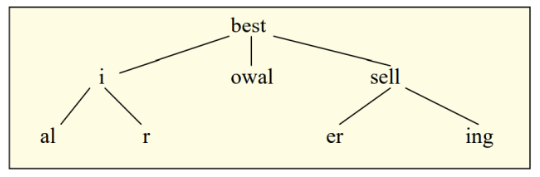

- void insert(TK id,string key):  O(n) donde n es el número total de nodos.
- bool search(string key): O(size) donde size es el tamaño de la palabra que se esta buscando.
- void remove(string key)) : O(size), donde size es el tamaño de la palabra que se quiere eliminar.

#### Blockchain:
Simula un blockchain basándose en la lista doblemente enlazada con centinela, la estructura Block y la función de hash SHA256. Como necesitamos la huella del anterior blockchain, es necesario un puntero al anterior y uno al siguiente para que el insert sea mas sencillo. Para la estrategia de asegurar la integridad de su contenido, hacemos uso de templates genericos al insertar los datos; estos se guardan en un array dinámico de strings donde los vamos desempacando.

  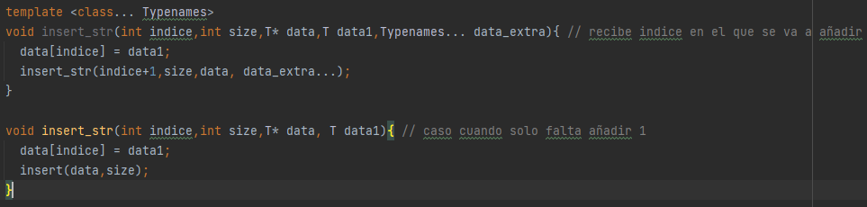

Aqui se pueden ver un caso general y un caso en donde los datos se desempacan de uno en uno. Una vez hecho esto, se llama a la función principal. En esta creamos un nuevo bloque con los datos correspondientes, lo enlazamos en la lista doblemente enlazada, aumnetamos la cantidad de nodos (que en este caso serían los bloques), actualizamos la huella del bloque anterior y buscamos un nonce correcto llamando a la función findnonce. 

  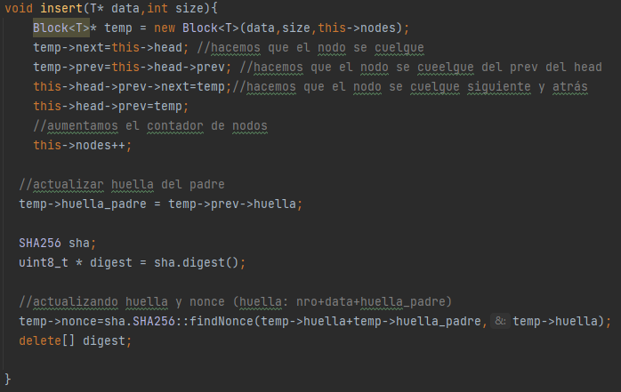

La forma en que implementamos el proof of work empieza evaluando desde el primer elemento, recorriendo los bloques de uno en uno con un puntero temporal hasta que llega al head (da toda una vuelta a la lista) y verifica que la variable hasheado sea true, si es que todos son true simplemente se recorre hasta el final de la lista. Caso contrario, el bloque que tiene el hasheado en false, llama a una función recalculate, donde el método del bloque concatena al nonce, los datos del bloque y la huella del padre para que se vuelva a encontrar un nonce y poder corregir la huella para que el hasheado de true. 

Esto se repite hasta corregir todos los bloques desde el primer bloque donde se encontró el primer false hasta el final mediante un bucle while

  

##### Complejidades de los metodos:
 i) Modificar bloque: Este metodo tendria una complejidad de O(ind + values + n) donde ind es la posicion del bloque, values la cantidad de datos nuevos que se van a asignar y n el número de bloques. Este n viene de la función verificar_hash donde recorre los bloques desde el actual al ultimo. En el peor de los casos tendría que recorrer todos los bloques, por lo tanto, es n.

  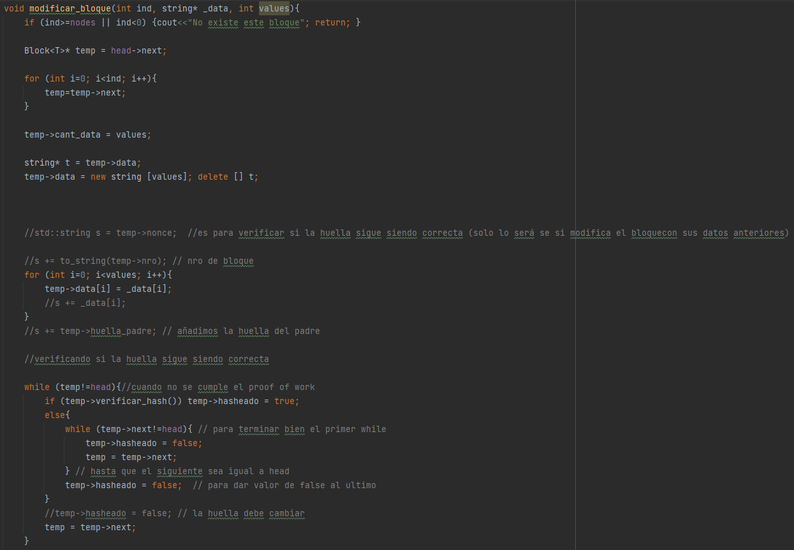

 

 ii) Eliminar bloque: Este metodo tendria una complejidad de O(pos + n) donde pos es la posición del bloque, que va desde el inicio hasta la posición, y n viene a ser el número de bloques que viene de la misma función verificar_hash.

  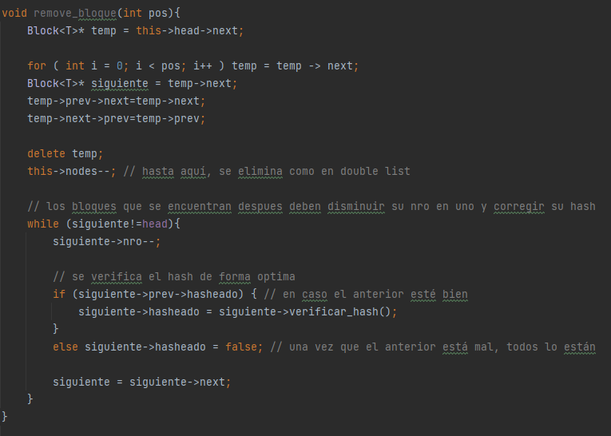

 

iii) Insertar bloque: Este metodo tendria una complejidad de O(n) donde n es el numero de iteraciones hasta que see consiga un nonce valido, es decir que empiece con 4 ceros. La función findNonce utiliza un bucle while que itera hasta encontrar un un hash con el prefio objetivo, que en el peor de los casos, sería n veces.

  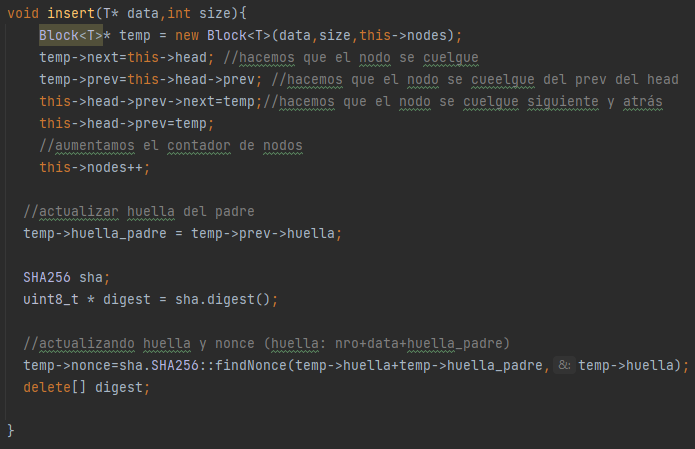

 

  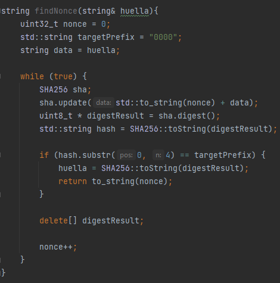

 

iv) Recalculo en cascada: El metodo tendría una complejidad de O(m * n) donde m es la cantidad de bloques y n es el número de iteraciones hasta que se consiga un nonce válido. La función recalculo_cascada utiliza un while para recorrer la lista enlazada, que en el peor de los casos, recorrería todos los bloques que hay en la lista. Esta función utiliza a recalculate que reinica la huella del bloque, concatena el número del bloque con los datos y la huella del bloque padre con la huella actual, todas estas funciones son O(1) pero se vuelve a llamar a la función findNonce que itera hasta encontrar un hash con el prefijo objetivo que en el peor de los casos son n iteraciones.

  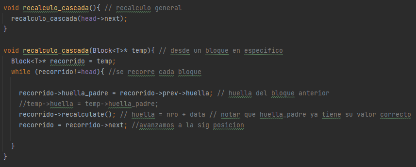

 

  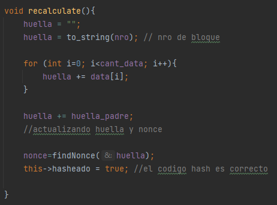

 

## Interfaz grafica
Estamos desarrollando nuestro proyecto utilizando el framework Qt, el cual nos permite crear una interfaz gráfica de usuario (GUI). Con la interfaz gráfica, podemos interactuar con el sistema mediante elementos visuales como ventanas, botones, menús y otros componentes gráficos. Esta interfaz nos proporciona una forma intuitiva y atractiva visualmente para interactuar con el software, en contraste con las interfaces de línea de comandos que requieren la entrada de texto.
### 🔗 Repo de la interfaz.

## Tabla de complejidades

## Bibliografía

- Domínguez Gómez, J. (n.d.). Criptografía: Función SHA-256. https://academy.bit2me.com/wp-content/uploads/2019/10/Criptography_SHA_256_es.pdf

‌- ecanorea. (2021, October 19). Qué es el blockchain y cómo funciona. Plain Concepts. https://www.plainconcepts.com/es/blockchain-guia-principiantes/

‌- Matesanz, V. (2022, January 11). Qué es el blockchain, cómo funciona y cuál es su relación con las criptos [Guía Fácil]. Finect; Finect. https://www.finect.com/usuario/vanesamatesanz/articulos/que-blockchain-criptomonedas-guia-facil#:~:text=El%20blockchain%20es%20un%20ecosistema,forma%20segura%2C%20r%C3%A1pida%20y%20descentralizada.

‌
